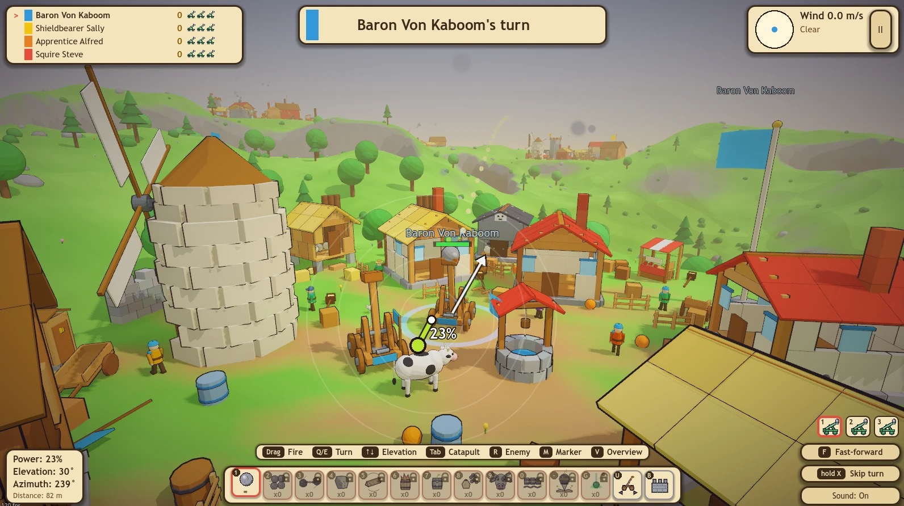
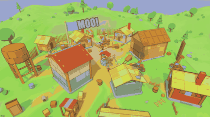

# Medieval Madness

A turn-based, physics-heavy 3D artillery game for 2-8 players (humans and/or CPU bots), on one screen or online, alone or in teams.
Everybody owns a medieval village and 5 catapults. Take turns firing one shot at any other village.
Everything is a physics object and destructible, fire spreads, water puts it out, settlers become ragdolls and
shout jokes. Lose all 5 catapults and you are out - the last player standing wins.



## Physics is the game

Nothing in Medieval Madness is a canned animation: a village is a pile of real rigid bodies (Jolt Physics, 60 Hz) and every shot is
just something heavy flying into it. What happens next is up to the simulation.



*One Drill Bomb: it drills to sea level, explodes underground and the village collapses into the pit - all of it simulated, nothing scripted.*

* **Buildings are made of parts**: planks, beams, stones and shingles with their own material, weight, break strength and flammability.
  A boulder shatters planks but only chips granite; thatch burns in a flash. Shoot away the ground floor and everything above comes down.
* **Shots fly on real trajectories** (gravity, wind) and roll on: a boulder digs a furrow through the houses.
* **The ground gives way**: craters, landslides and the Drill Bomb reshape the terrain, and what stands on it falls with it.
* **Fire** creeps from part to part, **water** puts it out and floats barrels, **powder kegs** explode in chains with a pressure wave.
* **Settlers and animals are ragdolls**: hit one and it flies.

Built with **Godot 4.4+ (tested with 4.7.2)**, GDScript only, Jolt Physics. Renderer: Forward+ on Windows and macOS, Compatibility (OpenGL) on Linux, Mobile on phones.
All graphics are procedural and all sounds are synthesized at startup; the only image files are CC0 textures used by the Natural graphics style (see Credits).

## Run

**Download** (Releases page, one ZIP per platform), unzip, start:

* **Windows**: run `MedievalMadness.exe`.
* **macOS**: the app is only ad-hoc signed (no paid Apple developer account), so macOS warns on the first start ("cannot be opened" / "is damaged"). Either right-click the app -> *Open* -> *Open*, or on newer macOS go to *System Settings -> Privacy & Security* and press *Open Anyway* after the first blocked start, or remove the quarantine flag once:
  `xattr -dr com.apple.quarantine "Medieval Madness.app"`
* **Linux** (x86_64 only; any current distribution, e.g. Ubuntu, Arch / CachyOS): `chmod +x MedievalMadness.x86_64 && ./MedievalMadness.x86_64`. It needs no Vulkan: Linux uses the OpenGL (Compatibility) renderer by default. With a working Vulkan driver you can get the full look: `./MedievalMadness.x86_64 --rendering-method forward_plus`.

**From source** (needs Godot):

```bash
./run.sh                 # or:  godot --path .          (Windows: run.bat)
godot --path . -- --debug   # enables the debug keys (see below)
```

Needs `godot` (4.4 or newer, standard non-.NET build) on the `PATH`; on macOS `brew install --cask godot`.

## Build standalone executables

```bash
./export.sh              # Windows / macOS / Linux into build/   (Windows: export.bat)
```

Every export increases the patch number in `VERSION` (shown in the menu and sent when joining online).

The export presets live in `export_presets.cfg` (Windows x86_64 single .exe with embedded PCK, macOS universal .zip,
Linux x86_64 single file). They need the matching Godot **export templates** (Editor -> Manage Export Templates).
`build/` is git-ignored.

## Controls

| Action | Input |
|---|---|
| Aim + fire (slingshot) | Hold the **left mouse button anywhere**, pull *away* from where you want to shoot, release to fire. The white arrow starts at the catapult and shows the real flight direction on screen (the camera is frozen while you pull); pull length = power |
| Elevation | `Up`/`Down` (also while pulling) or `Shift` + mouse wheel |
| Cancel a pull | `Esc`, or pull back to less than 10 px |
| Orbit camera | Right mouse drag (aiming: +-60 deg / +-25 deg around the chase view) |
| Zoom | Mouse wheel |
| Choose ammo | `1`-`8` or click the ammo bar (locked weapons are dimmed with a padlock until earned) |
| Turn actions instead of a shot | `U` = relocate the selected catapult (`W`/`S` drive, `A`/`D` steer, any distance, `Space` ends the turn; people, animals and crates are no obstacle, buildings are rammed and take damage - the neighbours comment on it). `B` = build a stone wall (click sets it, `Q`/`E` turns it, next to a wall it continues it, click on a wall stacks another layer, only the top layer keeps its crenellations). Both sit at the right end of the weapon bar with a grey rim; the strip above the bar always lists what is possible right now |
| Choose catapult | `Tab` / `Shift+Tab`, click a catapult, or use the numbered catapult buttons (bottom right) |
| Skip the aftermath | click or `Space` after the first impact |
| Fine aim | Arrows (azimuth / elevation, `Shift` = finer), `W`/`S` power, `Space` fire |
| Face the next enemy village / your marker | `R` / `X` |
| Map (overview camera) | `M` - shows the whole map (drag to orbit, middle mouse or `Shift`+right drag to pan, `WASD` pans, `Home` recenters) |
| Map marker | On the map **left-click the ground or press `X`** to set your one marker (new click moves it, click on it or `Shift`+click removes it). It stays for the whole match; while aiming a dashed line, a compass label and the range readout point to it |
| Skip turn | hold `Tab` for 2 s (or hold the button); a short `Tab` picks the next catapult |
| Pause / options | `Esc` |
| Fullscreen | `F11` |
| Placement | click ground = place, `Q`/`E` rotate, right click / `Z` removes the last one |
| Fast-forward (3x) | `F`, the `Fast-forward` button, or `Space` outside your own aiming phase - handy during CPU turns; it switches itself off when it is your turn to aim |

**Aiming in detail** - the pull direction is opposite to the launch direction: drag *left* to aim *right*, drag
*down* to lob higher. Power = pull length (up to 220 px), azimuth = 0.25 deg per pixel, elevation = 15 deg + 0.3 deg per pixel
of downward pull. The first 40% of the flight path is previewed as dotted spheres; wind and per-ammo drag are included.
The HUD shows power / elevation / azimuth and the distance to the predicted landing point.

## Teams

The player colour is the team: give several players the same colour and they play as one team (no limit, no symmetry needed;
a match needs at least two colours). Turn order stays as it is. A team wins together as soon as no catapult of another team is
left. Allies are not targeted by the bots or by `R`, hits on allies count as own goals, markers set on the map are shown to the
whole team (online too), every village has a flagpole in its team colour and window frames in a darker shade of it.

See [CHANGELOG.md](CHANGELOG.md) for the release notes (kept up to date together with `SPEC.md`).

## Rules in twenty seconds

* Placement: every player puts 5 catapults inside their village zone (green ghost = valid).
* Each turn: pick a catapult, pick ammo, pull, release. Wind changes every turn; weather (rain, thunderstorm, storm)
  and random events (dragon, cheese meteor, cow rain, earthquake, geese, tax collector, fireworks, wizard bubble, flood)
  can spice things up.
* Ammo: Boring Rock (unlimited), Flaming Chamber Pot, Mighty Powder Keg, Splashy Water Balloon, Grandma's Buckshot,
  Moo-nition (a cow), Stone Hail, Chain Shot, Pointy Log and the Meteor Marker.
* A catapult dies at 0 hp, when it tips over for 3 s, or when it sinks in deep water. Eliminations are checked at the end of
  each turn.
* Spectacular hits (direct catapult hits) play in cancelable bullet time; the camera always stays on the impacted village.

## Debug keys (only with `-- --debug`, or in debug builds)

`B` test ball - `E` cycle random events - `W` cycle weather - `K` kill selected catapult - `F` ignite under the cursor -
`V` explode at the cursor - `C` collider wireframes - `H` heal catapults - `T` slow motion - `O` outlines - `F3` debug overlay.

## Tests

```bash
godot --headless --path . --script res://tests/run_tests.gd    # logic tests without autoloads (~2000 assertions)
godot --path . -- --autotest=units                             # in-scene physics / fire / ragdoll / powder-chain tests
godot --path . -- --autotest=cpugame --seed=x --wall=300       # 4 bots (Peasant, Squire, Knight, King) play a whole game
godot --path . -- --autotest=ammo                              # fires all 8 ammo types (screenshots in user://)
```

Other autotest scenarios: `menu`, `placement`, `village`, `shoot`, `physics`, `hud`, `perf`, `sound`. Screenshots are saved to
`user://shot_*.png` (macOS: `~/Library/Application Support/Godot/app_userdata/Medieval Madness/`).

## Online play

Up to 8 players over the internet, no server of your own to run (a free Cloudflare worker as relay, or any machine with Godot). Setup and rules: [relay/README.md](relay/README.md).

## Credits

The **Natural** graphics style uses material textures from ambientCG:

Created using [Bark014](https://ambientcg.com/a/Bark014), [Wood092](https://ambientcg.com/a/Wood092), [Granite002A](https://ambientcg.com/a/Granite002A), [Bricks097](https://ambientcg.com/a/Bricks097), [ThatchedRoof001A](https://ambientcg.com/a/ThatchedRoof001A), [Fabric081C](https://ambientcg.com/a/Fabric081C), [Metal049A](https://ambientcg.com/a/Metal049A), [Grass004](https://ambientcg.com/a/Grass004), [Grass007](https://ambientcg.com/a/Grass007), [Ground110](https://ambientcg.com/a/Ground110), [RoofingTiles004](https://ambientcg.com/a/RoofingTiles004) and [PavingStones150](https://ambientcg.com/a/PavingStones150) from [ambientCG.com](https://ambientcg.com), licensed under the Creative Commons CC0 1.0 Universal License.

Made with Godot Engine. Everything else (code, look, sounds, jokes) is original; no other external assets are used.
